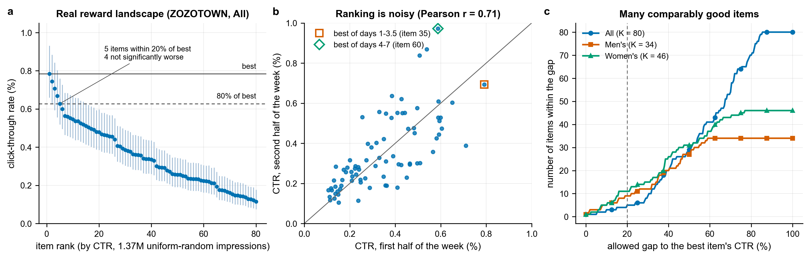
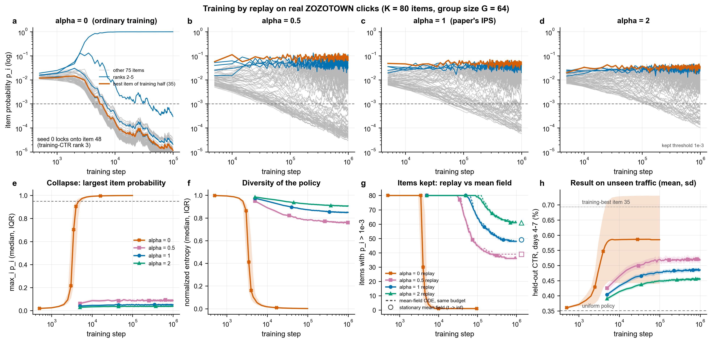
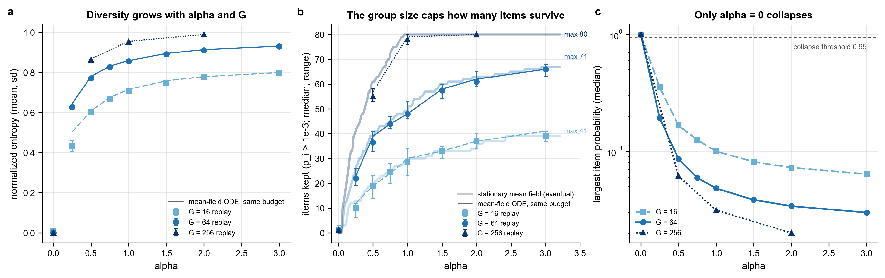
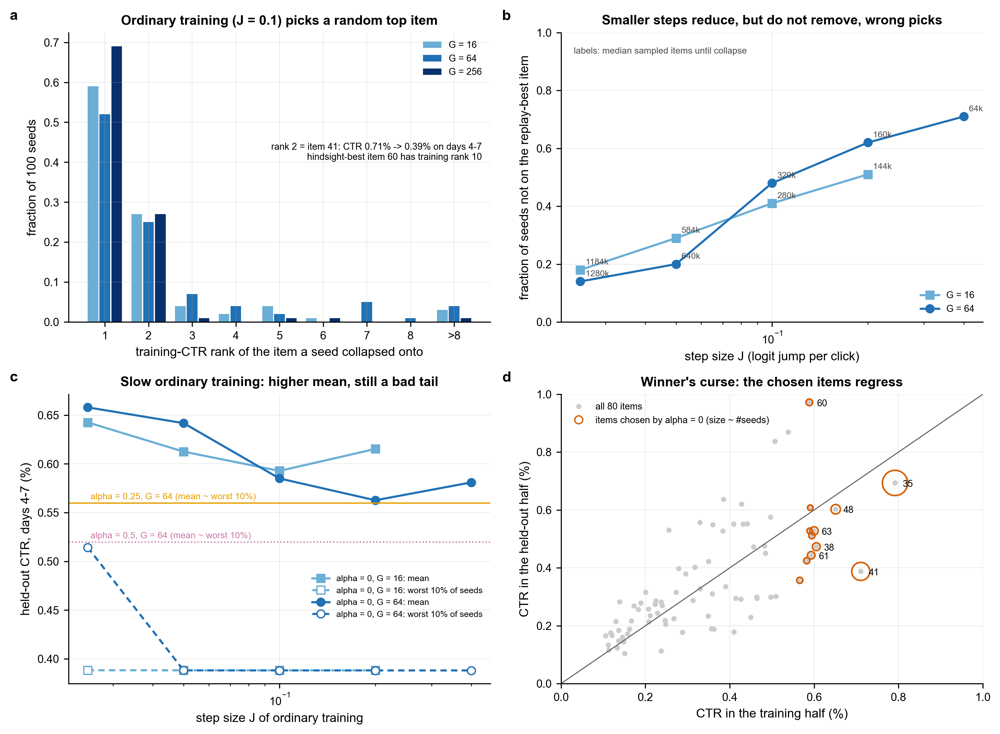
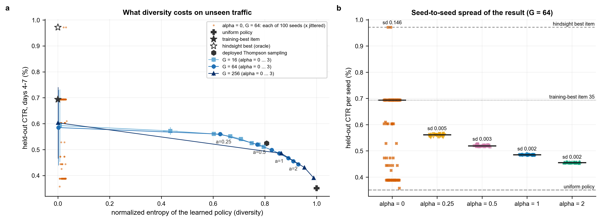
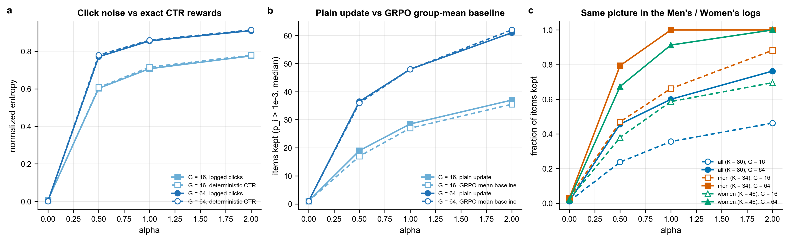
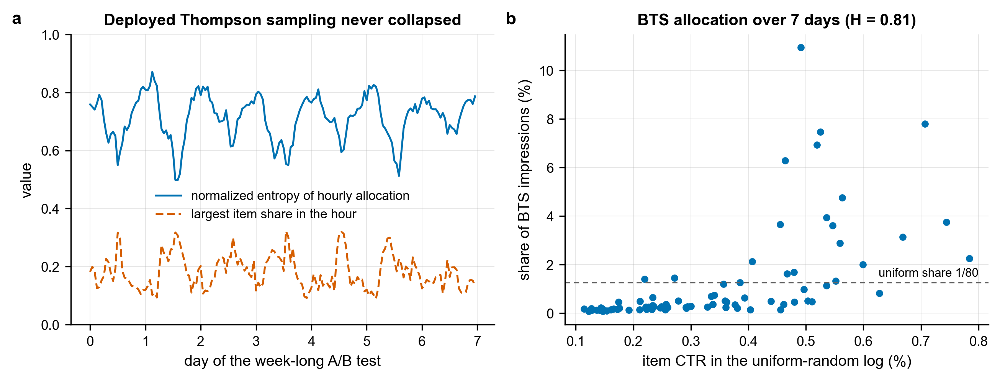
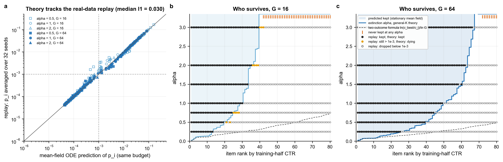

# Case 3: Does α-IPS stop mode collapse on real bandit data? ZOZOTOWN Open Bandit Dataset

*CSE 402, Section A, Group 04, next phase, task 3 (finding data from a real RL system and testing the model on it). Base paper: Sinha, Elango & Liu (2026), arXiv:2601.21669.*

*Code is in [`case3/`](case3/), figures in [`case3/figures/`](case3/figures/), and tables (CSV/JSON) in [`case3/results/`](case3/results/). Every results table below (T1–T8) is generated by `case3/report_tables.py` from the saved results and copied verbatim from `case3/results/report_tables.md`.*

## Summary

- **Which data:** the log of a real, deployed bandit system: the **Open Bandit Dataset** (the Japanese fashion e-commerce site ZOZOTOWN; a 7-day A/B test in November 2019; license CC BY 4.0).
  - Main part, the "All" campaign: **80 items**, **1,374,327 impressions** from the uniform-random policy, **4,768 clicks** (CTR 0.347%).
  - Also the Men's (34 items) and Women's (46 items) campaigns.
  - Unzipped, the full dataset is 11.7 GB, so only the needed parts were streamed. The data on disk take only 11 MB.
- **"Many good outcomes" really exist:** in "All" the best item's CTR is 0.784%, and **5 items are within 20% of the best** (9 in Men's, 11 in Women's). Even which item is truly best is uncertain: the best item of the first half of the week drops to rank 4 in the second half (rank 13 in Men's, rank 20 in Women's).
- **What was done:** **replay training** on the log of the first 3.5 days. At every step G items are drawn from the policy, and each drawn item's reward is a **real logged click** of that item.
  - Runs: α = 0 … 3, G = 16/64/256, with the plain update and with the GRPO-baseline update.
  - In total **64 configurations**, each with 16–100 seeds and 10⁵–2×10⁶ steps.
  - The log of the last 3.5 days was kept apart and used only for evaluation (held-out).
- **Collapse stopped (the clearest result):** ordinary training (α = 0) collapsed onto one item in **100% of seeds** in every setting (max p > 0.95). **With α ≥ 0.25 not a single seed collapsed**, in all three campaigns, both time splits and both update rules. How many items survive is set by α and G: in "All" with α = 1, 28/48/78 items survive at G = 16/64/256.
- **α = 0 often gets stuck on the wrong item:** because of click noise, 12–48% of seeds collapse onto an item other than the best item of the training world. With exact-CTR rewards this rate is 0%.
  - In "All", about a quarter of the seeds get stuck on item 41, which gives only 0.388% CTR on the unseen days (29th of 80).
  - With 4× smaller steps (at 4× the sample cost) the error rate falls to 14–18%, but not to zero.
- **What got better:**
  - Results are almost the same from seed to seed: the sd of the unseen-day CTR is ≤ 0.015 percentage points (pp) with IPS, against 0.027–0.175 pp with α = 0.
  - The best items of the unseen days survive in the policy. For example, item 60 (0.972% on the unseen days) survives in 100% of seeds for α ≥ 0.5, but in only 0–3% of seeds for α = 0.
  - With a small α (0.25–0.5) the CTR of the worst 10% of seeds improves in 3 of 4 settings: e.g. from 0.388% to 0.553% in "All", and from 0.536% to 0.575–0.584% in Women's.
- **What did not get better / the cost (honestly):** **mean CTR did not increase everywhere.**
  - In "All" the mean unseen-day CTR is 0.585–0.603% for α = 0 and 0.391–0.572% for IPS (it falls as α grows).
  - Women's is the opposite: IPS (α = 0.5, and α = 1–2 at G = 16) gets 0.582–0.592%, while α = 0 gets 0.545–0.548%.
  - Most of these differences in the mean are not statistically significant: the value of an α = 0 policy rests on about 60 clicks of a single item (s.e. ≈ 0.08 pp). The only exception is α = 1 and 2 at G = 256 in "All": these two flattest policies clearly give lower CTR.
  - So we can say: IPS stops collapse and gives diversity, coverage and stability. We cannot say: IPS gives a higher CTR.
- **Our theory matched the real data:** with the real CTRs plugged in, the finite-G mean field predicts the replay very well.
  - Per-item survival agreement of 95–100% over 39 configurations.
  - Distance between the same-budget mean-field ODE and the replay's average policy: median ℓ1 = 0.029; with exact-CTR rewards ℓ1 ≤ 0.003.
  - The theory predicted in advance that **at G = 16 no α can keep more than 41 of the 80 items** (71 at G = 64, 80 at G = 256). In the replay the maximum at G = 16 was also 41.
  - The two-outcome formula ln(r₁/r₂)/ln G strongly underestimates the α needed here, so the general-K nested solver (Exp. 3) is required.

## What you need / what to do

- **To just look at the results, nothing is needed.** All figures are in `case3/figures/` and all tables in `case3/results/`. All tables together are in `case3/results/report_tables.md`.
- **To run it again:**
  - **Download:** you do not need to download anything yourself. `prepare_data.py` streams only the needed parts of the zip with HTTP range requests: random logs ≈ 41 MB, plus the optional BTS log ≈ 212 MB, total transfer ≈ 253 MB. The full 413 MB zip is never kept on disk.
  - **Disk:** ≈ 49 MB in total (data 11 MB + results 36 MB + figures 4 MB).
  - **Packages:** only python3 + numpy, scipy and matplotlib, which the repo already needs. No pandas/torch, so no `.venv` was created.
- **Command (from the repo root):** `bash next_phase/case3/run_all.sh`. Any stage that has already run is skipped. Measured times on this laptop (4 cores / 8 threads; during the last three stages the machine was shared with another job):
  - `prepare_data.py --bts`: 2.6 minutes
  - `landscape.py`: 5 seconds
  - `run_replay.py --suite main`: 17.4 minutes
  - `--suite variants`: 29.3 minutes (in two parts)
  - `--suite robustness`: 19.2 minutes
  - `--suite replication`: 24.1 minutes
  - `theory.py`: 7 minutes
  - `analyze.py` + `make_figures.py` + `report_tables.py`: 20 seconds
  - **Total ≈ 100 minutes.** On an idle machine with `WORKERS=4` it takes less, and every run stays under 15 minutes.
- **What to put in the report** (a new subsection "Validation on real bandit logs"):
  - Main figures: **Fig. 1** (reward landscape), **Fig. 2** (training traces), **Fig. 3** (α–G sweep), **Fig. 4** (theory vs replay), **Fig. 5** (CTR vs diversity trade-off).
  - Tables: the G = 64 rows of **T2a/T2b**, 4–5 rows of **T4**, and the first small table of **T5**.
  - In an appendix: Fig. 6 (α = 0's wrong items and the step size), Fig. 7 (deployed Thompson sampling), Fig. 8 (variants, and Men's/Women's).
  - The figures are in colour, but every line has its own marker/line style, so they stay readable in black-and-white print.
- **On slides** (4 slides are enough):
  - (1) which real data, and why there are "many good items" (Fig. 1)
  - (2) α = 0 collapses, α > 0 does not (top row of Fig. 2)
  - (3) the theory matches real data too, and G decides how many items survive (Fig. 4, Fig. 3b)
  - (4) the trade-off: collapse and bad seeds are stopped, but mean CTR does not rise (Fig. 5, the table in Section 4.4)
- **What to say as limitations** (details in Section 6):
  - This is offline replay, not a live deployment; the same logged clicks were resampled many times.
  - The policy does not use user context or slot position.
  - Clicks are very rare (CTR ≈ 0.35%), so even which item is best is uncertain.
  - "Better result" means no collapse, robustness, diversity and coverage; we cannot claim that mean CTR increased.
  - Extinction in the theory is slow (≈ 1/t), so with limited training some "dying" items are still above the threshold at the end.
- **Git:** `case3/.gitignore` ignores `data/`, `.venv/`, `__pycache__/` and the raw run files (`results/runs/`, `results/theory_runs/`). The scripts, figures and summary CSV/JSON files are small and are tracked in git.

---

## 1. Survey: real data logged by deployed bandit / RL systems

Checked on 2026-10-03 against the official pages, the papers, and the Hugging Face / Zenodo / Crossref APIs. Nothing here is guessed; "not verified" means we could not confirm it. "Unbiased replay" means a new policy can be evaluated or trained on the log without bias. That needs either uniform-random logging (Li et al. 2011) or logged propensities (importance weighting).

| Dataset | Source system (what was logged) | Link | License | Size | Access | Unbiased replay? | Suitability for this study |
|---|---|---|---|---|---|---|---|
| **Open Bandit Dataset (OBD)**, *chosen* | ZOZOTOWN fashion e-commerce: which item was shown in each of 3 slots and whether it was clicked, during a 7-day A/B test (late Nov 2019) of a uniform-random policy against Bernoulli Thompson sampling (BTS) | [research.zozo.com/data.html](https://research.zozo.com/data.html), [github.com/st-tech/zr-obp](https://github.com/st-tech/zr-obp), [arXiv 2008.07146](https://arxiv.org/abs/2008.07146) | CC BY 4.0 (dataset README) | 26M rows. Random logs: 1,374,327 (All, 80 items), 452,949 (Men's, 34) and 864,585 (Women's, 46). Zip is 413 MB, 11.7 GB unzipped | Direct download | **Yes.** Random logs are uniform; BTS rows carry propensities | **Best fit.** Fixed item sets, uniform logging and many similar items. Its only weakness is low CTR (0.35–0.5%) |
| Yahoo! R6A / R6B (Front Page Today Module) | Yahoo! front page news-article clicks, May 2009 (R6A) and Oct 2011 (R6B) | Webscope, `webscope.sandbox.yahoo.com` (did=49 for R6A) | Webscope academic terms | R6A: 45,811,883 visits, 271 articles, 1.1 GB. R6B: ~28M visits, 652 articles (sources disagree slightly) | Application with a university e-mail; the Webscope site did not resolve during our check | **Yes.** Articles were chosen uniformly at random; this is the data of Li et al.'s replay method | Good in principle, but the article pool changes over time (not a fixed set of K arms) and access needs approval |
| KuaiRand | Kuaishou short-video feed, with random videos inserted into real users' feeds (Apr 22 – May 8, 2022) | [kuairand.com](https://kuairand.com/), [github.com/chongminggao/KuaiRand](https://github.com/chongminggao/KuaiRand) | CC BY-SA 4.0 on GitHub (Zenodo metadata says CC BY 4.0) | 27K version: 1,186,059 random-exposure rows over 7,583 videos (plus 322M normal rows). Pure version: 194 MB | Direct download | **Yes for the random rows** (uniform over 7,583 videos) | Many arms but only ~156 random impressions per video, too thin for per-arm reward estimates |
| KuaiRec | Kuaishou: a fully observed user × video watch matrix (forced exposure) | [kuairec.com](https://kuairec.com/), [github.com/chongminggao/KuaiRec](https://github.com/chongminggao/KuaiRec) | CC BY-SA 4.0 on GitHub (CC BY 4.0 on Zenodo) | Small matrix: 1,411 users × 3,327 videos, 4,676,570 interactions (99.6% dense). Zip is 432 MB | Direct download | Not a bandit log, but fully observed, so any policy can be scored exactly | A good second option (pick K videos with similar watch ratio). The reward is a continuous watch ratio, not a click |
| MovieLens (GroupLens) | Ratings that users chose to give on the MovieLens site | [grouplens.org/datasets/movielens](https://grouplens.org/datasets/movielens/) | Research use; no commercial use without permission | e.g. ML-32M: 32,000,204 ratings | Direct download | **No.** These are ratings, not RL/bandit logs: users chose what to rate, with no randomized exposure and no propensities | Only for semi-synthetic simulators; not real logged RL data |
| Public LLM RL training rollouts | GRPO / RLOO training runs of LLMs: generated answers, per-sample reward, training step | HF [`max-rl/grpo_qwen3_1p7B_base_polaris_rollouts`](https://huggingface.co/datasets/max-rl/grpo_qwen3_1p7B_base_polaris_rollouts) (4.1M rollouts, no license stated), [`sweagent/iter2-rl-rollouts`](https://huggingface.co/datasets/sweagent/iter2-rl-rollouts) (GRPO on Qwen3.5-35B-A3B, MIT), [`OpenHands/CodeScout_Training_Rollouts`](https://huggingface.co/datasets/OpenHands/CodeScout_Training_Rollouts) (54,845 rows, no license stated) | Varies; often none | 10⁴–10⁶ rollouts, up to ~28 GB | Direct download | No: on-policy samples of a moving policy over an open-ended answer space, with no finite arm set and no fixed logging policy | Useful for measuring LLM-level mode collapse (e.g. answer diversity vs step), not for K-armed replay |
| Criteo counterfactual test-bed (Lefortier et al. 2016) | Criteo display ads: banner filling with logged propensities | `cs.cornell.edu/~adith/Criteo` (links returned HTTP 404 on 2026-10-03) | None stated | 103M+ impressions, 35 GB gz | Download links dead | Propensities are logged, but non-clicks are subsampled to 10% | Poor: slates with context-dependent candidate sets |
| Yahoo! R3 / Coat | Music ratings / a mock web shop, each with a small randomly selected test set | Webscope / `cs.cornell.edu/~schnabts/mnar` | Webscope / CC BY-NC | R3: 54,000 random ratings. Coat: 4,640 | Application / direct | Random test sets only | Too small, and ratings rather than logged decisions |
| Deezer carousel bandits | Deezer music-streaming carousel: a simulator built from real embeddings | [github.com/deezer/carousel_bandits](https://github.com/deezer/carousel_bandits) | CC BY 4.0 on Zenodo | 974,960 users, 862 playlists | Direct download | Not logs: released "ground-truth" display probabilities | A controllable simulator, not replay of real decisions |

**Statistics of the chosen data.** These come from Saito, Aihara, Matsutani & Narita, *"Open Bandit Dataset and Pipeline: Towards Realistic and Reproducible Off-Policy Evaluation"*, NeurIPS 2021 Datasets & Benchmarks, Table 1. Our own counts of the three random logs agree exactly.

| Campaign | Policy | Impressions | Items | CTR ± 95% CI |
|---|---|---|---|---|
| All | Random | 1,374,327 | 80 | 0.35% ± 0.010 |
| Men's | Random | 452,949 | 34 | 0.51% ± 0.021 |
| Women's | Random | 864,585 | 46 | 0.48% ± 0.014 |
| All | BTS | 12,168,084 in the table (12,357,200 rows in the released `bts/all/all.csv`) | 80 | 0.50% ± 0.004 |

## 2. Why the Open Bandit Dataset (uniform-random logs)

1. **It is a real deployed system.** ZOZOTOWN is Japan's largest fashion e-commerce site. The logs are a production A/B test, not a simulator.
2. **The logging policy is uniform random, so replay is unbiased.** We checked that every one of the 1,374,327 rows of `random/all` has propensity exactly 1/80 (34 and 46 items in the other two campaigns, also uniform).
   - Li, Chu, Langford & Wang, *"Unbiased offline evaluation of contextual-bandit-based news article recommendation algorithms"*, WSDM 2011, pp. 297–306 (doi:10.1145/1935826.1935878), show that when the logging policy picks arms uniformly at random, independent of the user, any new policy can be replayed on the log without bias.
   - For a context-free policy like ours, an item's logged clicks are exact samples of "show this item to a random visitor in a random slot".
3. **The arms are fixed.** The same items are available for the whole week, so "K outcomes" is well defined. Yahoo! R6, by contrast, has an article pool that keeps changing.
4. **Many outcomes are comparably good**, so collapse is a real risk (Section 4.1). The *identity* of the best item is also uncertain, which is exactly when betting everything on one item is dangerous.
5. **Open and easy to get.** CC BY 4.0, direct download. The same week also has a deployed bandit (Bernoulli Thompson sampling, 12,357,200 rows) that we use as a real-system reference.
6. **Weakness, stated up front:** rewards are sparse (CTR 0.35–0.51%) and there is only one week of data, so every CTR estimate is noisy. We handle this with a time split, many seeds and standard errors throughout.

## 3. Method: α-IPS training by replay of real clicks

### 3.1 Data actually used
- **What we downloaded.** The zip is 413 MB, and 11.7 GB unzipped, too big for this disk. `case3/prepare_data.py` reads the zip's table of contents with HTTP range requests and then streams only `random/{all,men,women}.csv` (41 MB compressed) and, for the reference, `bts/all/all.csv` (204 MB compressed).
- **What we kept.** For each row we keep only `timestamp, item_id, position, click, propensity_score`. Disk used: **11 MB**; the zip itself is never stored.
- **Main campaign.** "All", **K = 80 items**: 1,374,327 uniform-random impressions from Nov 24 to Nov 30, 2019. The propensity is 1/80 = 0.0125 in every row.
- **Time split.** Training uses only the first half of the rows: 687,164 impressions and 2,362 clicks, up to Nov 27 13:36 UTC. The second half (687,163 impressions, 2,406 clicks) is never touched during training and is used only for evaluation ("held-out CTR"). In the reversed split (B) the roles of the halves are swapped. Men's and Women's are split the same way.

### 3.2 The update rules we ran
The policy is p = softmax(z) over the K items; the state is just the K logits, as in every experiment of the project. One training step, for S independent seeds at once:

1. **Draw a group.** Draw a_1..a_G ~ p by inverse-transform sampling. This is the project's rule; our searchsorted implementation gives the same draws as `src.dynamics.inverse_transform_sample_batch` (checked: 100% identical).
2. **Real reward.** For each drawn item, pick a uniformly random logged impression of that item from the training half and use its click, R_g ∈ {0, 1}.
3. **Scale the reward.** Let n_i be the count of item i in the group, p̂_i = n_i/G, and r̄_i = (1/n_i) Σ_{g: a_g = i} R_g (0 if n_i = 0). The α-scaled reward, with the stop-gradient weight, is

   r̃_i = r̄_i · W_i,  W_i = max(p̂_i, ε)^(−α),  ε = 10⁻³.

   ε never binds here, because 1/G ≥ 1/256 > ε. The boost ceiling is therefore exactly G^α.
4. **Update** with z ← z + h ĝ, where ĝ is one of:

   - **(U1) plain, logged clicks.** The paper's / project's form (`rhs_sampled`) with per-sample rewards:

     ĝ_i = p̂_i r̃_i − p_i Σ_k p̂_k r̃_k

     This is the group REINFORCE gradient (1/G) Σ_g W_{a_g} R_g (e_{a_g} − p).
   - **(U2) plain, deterministic CTR** (the "real reward landscape" variant). Same as U1 with r̄_i replaced by c_i, the item's training-half CTR. On identical random draws it reproduces `src.dynamics.rhs_sampled` to 5 × 10⁻¹⁶ relative error.
   - **(U3) GRPO group-mean baseline, logged clicks.** No std normalization:

     ĝ_i = p̂_i (r̃_i − m),  m = Σ_k p̂_k r̃_k,

     where m is the mean of the G scaled rewards. This is (1/G) Σ_g (R̃_g − m)(e_{a_g} − p), and the −p term cancels because Σ_g (R̃_g − m) = 0.

   - **Ordinary training is α = 0** in all three, i.e. W_i = 1.

**Why replaying uniform-random logs is valid.**
- Li et al. (2011) show that when the logging policy picks each arm uniformly at random, independent of the user, the logged rewards of arm i are unbiased samples of "show arm i to a random visitor".
- Our policy uses no context, so resampling a logged impression of item i is an exact draw from item i's click distribution, Bernoulli(c_i), with c_i the item's CTR in the training half.
- A z-test on 200,000 resampled clicks per item gave z-scores with mean −0.14 and sd 1.04 (KS p = 0.13).
- Li et al.'s rejection replay uses each event at most once. With K = 80 it would leave only about 8,600 usable events in the training half, far too few to train with groups of 16–256. We therefore resample with replacement (bootstrap replay).
- The consequence: the replay world's "true" CTRs are the training-half estimates c_i, and only the held-out half measures how good those estimates were (Section 6).

### 3.3 Mean field with real (binary) rewards

**Plain update (U1).** Given the counts, the clicks are independent Bernoulli(c_i) and the update is linear in them, so E[r̄_i | n] = c_i. Hence

  E[ĝ_i] = c_i φ_G(p_i) − p_i Σ_k c_k φ_G(p_k),  φ_G(p) = E[p̂ max(p̂, ε)^(−α)].

This is **exactly the project's deterministic mean field with r = CTR**. The finite-group theory (`meanfield_stationary`, `extinction_alpha`, `kept_at_large_alpha` in `src/finite_group_general.py`) therefore applies unchanged with r = c:
- an interior item satisfies c_i w_G(p_i) = S, with w_G(p) = φ_G(p)/p;
- item j is extinct iff c_j · min(G, 1/ε)^α ≤ S.

A Monte-Carlo check with 0/1 clicks (200,000 groups) matches this drift within 1.5 standard errors.

**GRPO baseline (U3), a new small derivation.** For k ≠ i the multinomial gives E[n_i | n_k] = (G − n_k) p_i/(1 − p_k). Therefore

  E[ĝ_i] = u_i − p_i Σ_k u_k,  u_k = c_k ψ_G(p_k)/(1 − p_k),  ψ_G(p) = E[p̂ ω(Gp̂)(1 − p̂)],  ω(n) = max(n/G, ε)^(−α).

The stationary condition is c_i w̃_G(p_i) = S, and two size-biasing steps give

  w̃_G(p) = (1 − 1/G) · E[ω(1 + B)],  B ~ Binomial(G − 2, p).

- This is implemented as `GroupMeanBaselineRule` (in `case3/obd_ips.py`) and solved with `src.meanfield_rule.stationary`.
- **Its range is w̃_G(0)/w̃_G(1) = (G − 1)^α instead of G^α**, so the two-outcome survival threshold becomes α > ln(r₁/r₂)/ln(G − 1). That is 2.4% higher at G = 16 and 0.4% higher at G = 64.
- A Monte-Carlo check (200,000 groups) matches the drift within 0.5 standard errors.

**Mean-field ODE over the same budget.** Doomed items die only algebraically: near p_j = 0, dp_j/dt ≈ −δ_j p_j², so p_j(t) ≈ 1/(1/p_j(0) + δ_j t) with δ_j = S − c_j G^α. A finite run may therefore not have reached the stationary point. We also integrate

  dz_i/dt = p_i (c_i w_G(p_i) − S(p)),  S(p) = Σ_k p_k c_k w_G(p_k),

from the uniform policy over exactly the replay's budget (time T·h). We use RK4 (`src.integrators.rk4_step`) with step doubling until the time-averaged policy changes by less than 10⁻⁴ in ℓ1, and compare it with the replay at the same time.

### 3.4 Settings (64 configurations, `case3/run_replay.py`)
- **Step size.** h = J · G^(1−α), with J = 0.1 unless stated. One click on an item drawn once in its group then moves that item's logit by the same J for every α and G, so no run "learns faster" just because of its α.
- **main** (20 runs, "All").
  - α ∈ {0, 0.25, 0.5, 0.75, 1, 1.5, 2, 3} × G ∈ {16, 64}, plus G = 256 for α ∈ {0, 0.5, 1, 2}.
  - α > 0: 32 seeds × 10⁶ steps (4 × 10⁵ at G = 256).
  - α = 0: 100 seeds × 10⁵ steps. Collapse is absorbing, and we want the distribution of the item each seed locks onto.
- **variants** (16 runs, "All"): U2 (deterministic CTR) and U3 (GRPO baseline) for α ∈ {0, 0.5, 1, 2} × G ∈ {16, 64}.
- **robustness** (12 runs, "All").
  - α = 0 with J ∈ {0.025, 0.05, 0.2, 0.4} at G = 64 and J ∈ {0.025, 0.05, 0.2} at G = 16. Steps are scaled as 10⁵ · max(1, 0.1/J); there are 50 seeds at J = 0.025 and 100 otherwise.
  - The reversed split B for α ∈ {0, 0.5, 1, 2} at G = 64.
  - α = 0.25 at G = 16 with J = 0.05 (2 × 10⁶ steps, 16 seeds) as a mean-field accuracy check.
- **replication** (16 runs): Men's and Women's, α ∈ {0, 0.5, 1, 2} × G ∈ {16, 64}.
- **Seeds** are fixed per configuration (`run_replay.cfg`).
- **Learned policy** = the time average of p over the last 25% of steps.
- **Metrics:**
  - collapse = max_i p_i > 0.95 (final policy);
  - normalized entropy H = −Σ p ln p / ln K;
  - kept = #{p_i > 10⁻³} (also 10⁻⁴);
  - ℓ1 to the ideal target c^(1/α)/Σ, to the CTR-proportional target and to the theory;
  - expected CTR V(p) = Σ_i p_i c_i under the training half and under the held-out half, with statistical s.e. √(Σ p_i² c_i(1 − c_i)/n_i) from the binomial noise of the CTR estimates;
  - coverage of the held-out top items.

## 4. Results

### 4.1 The real reward landscape ([Fig. 1](case3/figures/fig1_landscape.png))

#### T1. Reward landscape (uniform-random logs, all 7 days)

| campaign | impressions | K | clicks | CTR % | best item CTR % [95% CI] | best/worst | within 10% | within 20% | within 50% | not sig. worse than best | P(top item is truly best) | split-half r | rank of days-1-3.5 best in days 4-7 |
|---|---|---|---|---|---|---|---|---|---|---|---|---|---|
| all | 1,374,327 | 80 | 4,768 | 0.347 | 0.784 [0.660, 0.931] | 6.8 | 3 | 5 | 29 | 4 | 0.56 | 0.71 | #4 |
| men | 452,949 | 34 | 2,321 | 0.512 | 0.765 [0.628, 0.933] | 2.4 | 5 | 9 | 27 | 10 | 0.28 | 0.27 | #13 |
| women | 864,585 | 46 | 4,163 | 0.482 | 0.780 [0.663, 0.916] | 4.3 | 5 | 11 | 31 | 11 | 0.34 | 0.54 | #20 |



*Fig. 1.*
- (a) Per-item CTR of the "All" campaign with 95% Wilson intervals, from all 1,374,327 uniform-random impressions.
- (b) CTR in the first vs second half of the week. The first-half best (item 35) ranks only 4th in the second half; the second-half best (item 60) was 10th in the first.
- (c) How many items lie within a given gap of the best, for the three campaigns.

"Many good outcomes" holds in all three campaigns:
- **All:** 5 of 80 items are within 20% of the best and 29 within 50%. Only 4 items, the top one included, are not significantly worse than it (one-sided 5% test).
- **Men's:** 9 of 34 items are within 20%.
- **Women's:** 11 of 46 items are within 20%.

The ranking is also noisy. Even with all 7 days, the top item has only a 56% posterior probability (independent Beta posteriors) of truly being the best in "All", and 28% and 34% in Men's and Women's. Across the two halves of the week, CTRs correlate only with r = 0.71, 0.27 and 0.54.

Two smaller facts:
- Display position matters little: 0.354%, 0.347% and 0.340% for the left, centre and right slot. The uniform logger balances positions anyway.
- Daily CTR varies between 0.30% and 0.38% over the week.

### 4.2 Ordinary training collapses on real clicks; α-IPS does not ([Fig. 2](case3/figures/fig2_training_traces.png), [Fig. 3](case3/figures/fig3_alpha_G_sweep.png))

#### T2a. Collapse and diversity (All, K = 80; logged-click rewards; plain update; J = 0.1)

| alpha | G | seeds x steps | collapsed seeds (max p > 0.95) | max p (median) | entropy H (mean) | effective items e^(H ln K) | kept p > 1e-3 (median [range]) | kept p > 1e-4 | l1 to ideal c^(1/alpha) | l1 to p ~ c |
|---|---|---|---|---|---|---|---|---|---|---|
| 0 | 16 | 100 x 100,000 | 100% | 0.997 | 0.008 | 1.0 | 1 [1-3] | 3 | 0.82 | 1.94 |
| 0.25 | 16 | 32 x 1,000,000 | 0% | 0.354 | 0.434 | 6.8 | 10 [6-12] | 28 | 1.01 | 1.58 |
| 0.5 | 16 | 32 x 1,000,000 | 0% | 0.167 | 0.603 | 14.1 | 19 [14-23] | 47 | 1.06 | 1.33 |
| 0.75 | 16 | 32 x 1,000,000 | 0% | 0.125 | 0.667 | 18.6 | 24 [20-28] | 65 | 1.08 | 1.18 |
| 1 | 16 | 32 x 1,000,000 | 0% | 0.100 | 0.707 | 22.2 | 28 [23-34] | 75 | 1.06 | 1.06 |
| 1.5 | 16 | 32 x 1,000,000 | 0% | 0.081 | 0.749 | 26.6 | 33 [30-35] | 80 | 1.05 | 0.94 |
| 2 | 16 | 32 x 1,000,000 | 0% | 0.073 | 0.776 | 29.9 | 37 [34-40] | 80 | 1.03 | 0.85 |
| 3 | 16 | 32 x 1,000,000 | 0% | 0.064 | 0.796 | 32.7 | 39 [37-41] | 80 | 1.03 | 0.78 |
| 0 | 64 | 100 x 100,000 | 100% | 0.999 | 0.002 | 1.0 | 1 [1-2] | 1 | 0.96 | 1.95 |
| 0.25 | 64 | 32 x 1,000,000 | 0% | 0.193 | 0.627 | 15.6 | 22 [19-26] | 32 | 0.47 | 1.20 |
| 0.5 | 64 | 32 x 1,000,000 | 0% | 0.086 | 0.771 | 29.3 | 36 [33-41] | 50 | 0.50 | 0.82 |
| 0.75 | 64 | 32 x 1,000,000 | 0% | 0.060 | 0.827 | 37.5 | 44 [42-47] | 63 | 0.51 | 0.62 |
| 1 | 64 | 32 x 1,000,000 | 0% | 0.048 | 0.855 | 42.5 | 48 [46-53] | 72 | 0.52 | 0.52 |
| 1.5 | 64 | 32 x 1,000,000 | 0% | 0.038 | 0.891 | 49.5 | 58 [54-60] | 80 | 0.51 | 0.38 |
| 2 | 64 | 32 x 1,000,000 | 0% | 0.034 | 0.910 | 54.0 | 61 [59-65] | 80 | 0.49 | 0.30 |
| 3 | 64 | 32 x 1,000,000 | 0% | 0.030 | 0.930 | 58.7 | 66 [63-68] | 80 | 0.47 | 0.22 |
| 0 | 256 | 100 x 100,000 | 100% | 1.000 | 0.001 | 1.0 | 1 [1-2] | 1 | 0.62 | 1.94 |
| 0.5 | 256 | 32 x 400,000 | 0% | 0.061 | 0.864 | 44.0 | 55 [53-58] | 74 | 0.17 | 0.48 |
| 1 | 256 | 32 x 400,000 | 0% | 0.031 | 0.953 | 65.1 | 78 [76-80] | 80 | 0.11 | 0.11 |
| 2 | 256 | 32 x 400,000 | 0% | 0.020 | 0.989 | 76.2 | 80 [80-80] | 80 | 0.05 | 0.16 |



*Fig. 2.* Replay training on real clicks, G = 64.
- (a–d) All 80 item probabilities of one seed, log scale. The orange line is the training half's best item (35), the blue lines are ranks 2–5, and the dashed line is the 10⁻³ "kept" threshold. Seed 0 of α = 0 locks onto item 48 (rank 3).
- (e–h) Median and interquartile range over seeds of the largest probability, the normalized entropy and the number of items kept. Panel (g) also shows the mean-field ODE for the same budget (dashed) and the stationary prediction (open markers). Panel (h) shows the held-out CTR (mean ± sd).



*Fig. 3.* Entropy, items kept and largest probability versus α for G = 16, 64 and 256.
- **Markers:** replay.
- **Thin lines:** mean-field ODE for the same budget.
- **Thick pale lines in (b):** the stationary mean field (the eventual number of survivors).
- **"max" labels:** how many items any α can keep at that G (`kept_at_large_alpha`).

**What the data say.**
- **Ordinary training collapses every time.** With α = 0, every one of 300 seeds collapses (G = 16, 64, 256; max p ≥ 0.997). It takes a median of 17,500, 5,000 and 1,500 steps, i.e. 2.8–3.8 × 10⁵ sampled items. This holds for every α = 0 run we made: 19 configurations covering three campaigns, two time splits, five step sizes, both update rules and exact-CTR rewards (T3).
- **No IPS run collapses.** With α ≥ 0.25, none of the 45 IPS configurations (each with 16–32 seeds) has a collapsed seed. The median (over seeds) largest item probability is at most 0.354 (α = 0.25, G = 16). No single seed's final policy put more than 0.587 on one item.
- **α is a diversity knob.** For G = 64, the median number of items kept rises 22 → 36 → 44 → 48 → 58 → 61 → 66 for α = 0.25 → 0.5 → 0.75 → 1 → 1.5 → 2 → 3. The normalized entropy rises from 0.63 to 0.93.
- **The group size caps survival, as our theory predicts.** G = 16 never keeps more than 41 of the 80 items. G = 64 keeps at most 68, and G = 256 keeps 78 at α = 1 and all 80 at α = 2.
- **With G ≤ 64 the paper's ideal target p* ∝ c^(1/α) is not reached.** The ℓ1 distance to it is 0.47–1.08, because the finite-group law, not the ideal formula, sets the result. Only G = 256 > K comes close (ℓ1 = 0.05–0.17).

### 4.3 Where ordinary training collapses: often a wrong item, because of click noise ([Fig. 6](case3/figures/fig6_alpha0_collapse.png))

#### T3. Ordinary training (alpha = 0): where the collapse lands

| campaign | split | reward | update | G | J | seeds | item:seeds | not replay-best | not held-out-best | outside held-out top 5 | median steps to collapse | median draws | held-out CTR % (mean ± sd) | 10th pct |
|---|---|---|---|---|---|---|---|---|---|---|---|---|---|---|
| all | A | click | grpo | 16 | 0.1 | 100 | 35:59, 41:29, 48:7, 63:3, 60:1, 61:1 | 41% | 99% | 40% | 19500 | 312000 | 0.594 ± 0.141 | 0.388 |
| all | A | click | grpo | 64 | 0.1 | 100 | 35:55, 41:27, 48:9, 63:4, 47:2, 42:1, 43:1, 61:1 | 45% | 100% | 45% | 5000 | 320000 | 0.586 ± 0.133 | 0.388 |
| all | A | click | plain | 16 | 0.025 | 50 | 35:41, 41:8, 48:1 | 18% | 100% | 18% | 74000 | 1184000 | 0.643 ± 0.112 | 0.388 |
| all | A | click | plain | 16 | 0.05 | 100 | 35:71, 41:24, 48:2, 38:1, 43:1, 47:1 | 29% | 100% | 29% | 36500 | 584000 | 0.613 ± 0.130 | 0.388 |
| all | A | click | plain | 16 | 0.1 | 100 | 35:59, 41:27, 48:4, 63:4, 38:2, 42:1, 43:1, 47:1, 60:1 | 41% | 99% | 40% | 17500 | 280000 | 0.593 ± 0.140 | 0.388 |
| all | A | click | plain | 16 | 0.2 | 100 | 35:49, 41:12, 48:9, 42:7, 60:6, 63:6, 38:5, 34:2, 43:2, 61:2 | 51% | 94% | 45% | 9000 | 144000 | 0.615 ± 0.147 | 0.388 |
| all | A | click | plain | 64 | 0.025 | 50 | 35:43, 41:5, 47:1, 48:1 | 14% | 100% | 14% | 20000 | 1280000 | 0.658 ± 0.094 | 0.514 |
| all | A | click | plain | 64 | 0.05 | 100 | 35:80, 41:15, 48:4, 61:1 | 20% | 100% | 20% | 10000 | 640000 | 0.642 ± 0.111 | 0.388 |
| all | A | click | plain | 64 | 0.1 | 100 | 35:52, 41:25, 48:7, 61:5, 38:4, 60:2, 63:2, 34:1, 37:1, 42:1 | 48% | 98% | 46% | 5000 | 320000 | 0.585 ± 0.146 | 0.388 |
| all | A | click | plain | 64 | 0.2 | 100 | 35:38, 41:21, 48:8, 47:7, 63:6, 38:5, 43:4, 42:3, 34:2, 37:2, 61:2, 49:1, 60:1 | 62% | 99% | 61% | 2500 | 160000 | 0.563 ± 0.131 | 0.388 |
| all | A | click | plain | 64 | 0.4 | 100 | 35:29, 41:14, 48:9, 61:8, 60:7, 37:6, 42:5, 43:4, 47:4, 63:4, 39:3, 34:2, 77:2, 38:1, 58:1, 78:1 | 71% | 93% | 60% | 1000 | 64000 | 0.581 ± 0.175 | 0.388 |
| all | A | click | plain | 256 | 0.1 | 100 | 35:69, 41:27, 37:1, 43:1, 48:1, 63:1 | 31% | 100% | 31% | 1500 | 384000 | 0.603 ± 0.137 | 0.388 |
| all | A | ctr | plain | 16 | 0.1 | 100 | 35:100 | 0% | 100% | 0% | 17750 | 284000 | 0.693 ± 0.000 | 0.693 |
| all | A | ctr | plain | 64 | 0.1 | 100 | 35:100 | 0% | 100% | 0% | 4500 | 288000 | 0.694 ± 0.000 | 0.694 |
| all | B | click | plain | 64 | 0.1 | 100 | 60:68, 39:17, 58:14, 35:1 | 32% | 99% | 99% | 3500 | 224000 | 0.571 ± 0.037 | 0.507 |
| men | A | click | plain | 16 | 0.1 | 100 | 31:76, 27:20, 23:2, 12:1, 13:1 | 24% | 100% | 97% | 9500 | 152000 | 0.560 ± 0.030 | 0.554 |
| men | A | click | plain | 64 | 0.1 | 100 | 31:79, 27:20, 13:1 | 21% | 100% | 99% | 2500 | 160000 | 0.558 ± 0.027 | 0.554 |
| women | A | click | plain | 16 | 0.1 | 100 | 36:87, 21:8, 34:3, 24:1, 35:1 | 13% | 100% | 100% | 10500 | 168000 | 0.545 ± 0.037 | 0.536 |
| women | A | click | plain | 64 | 0.1 | 100 | 36:88, 21:8, 2:2, 34:2 | 12% | 100% | 98% | 3000 | 192000 | 0.548 ± 0.043 | 0.536 |



*Fig. 6.* Ordinary training (α = 0), "All" campaign.
- (a) Training-CTR rank of the item each seed locked onto (J = 0.1).
- (b) Fraction of seeds not on the replay world's best item, against the step size J. Labels give the median number of sampled items before collapse.
- (c) Held-out CTR of α = 0 against J (mean, and the worst 10% of seeds), with the α = 0.25 and 0.5 IPS results as horizontal lines.
- (d) Training-half vs held-out CTR of every item. The circles are the items α = 0 chose, sized by number of seeds.

**Click noise decides where ordinary training collapses.**
- **With exact rewards there is no mistake.** If the rewards were the exact CTRs, every α = 0 seed would collapse onto item 35, the best item of the replay world (0% wrong).
- **With real 0/1 clicks at the default step** (J = 0.1), 41% (G = 16), 48% (G = 64) and 31% (G = 256) of the seeds lock onto another item.
  - About a quarter of all seeds end on item 41. It is second in the training half (0.710%) but earns only 0.388% on the held-out days (29th of 80).
  - The best item of the held-out days, item 60 (0.972%), was only 10th in the training half. α = 0 picks it in 0–2 of 100 seeds.
- **The same happens elsewhere.** In Men's and Women's, 21–24% and 12–13% of α = 0 seeds miss the replay-best item. With the GRPO baseline the figures are 41–45%.
- **Learning more slowly helps but does not cure it** (Fig. 6b–c).
  - With a 4× smaller step (J = 0.025) the wrong-pick rate falls to 18% (G = 16) and 14% (G = 64), at the price of 4× more steps: a median of 1.18–1.28 million sampled items before collapsing, almost twice the 687,164-impression training log.
  - Its held-out CTR then averages 0.643% (G = 16) and 0.658% (G = 64), with the worst 10% of seeds at 0.388% and 0.514%.
  - Larger steps make it worse: 62–71% wrong at J = 0.2–0.4 with G = 64.
- **Reversed time split** (train on days 4–7): α = 0 collapses onto item 60 in 68% of seeds and onto items 39 and 58 in 31%. Those happen to be decent on days 1–3.5, so here its held-out CTR is 0.571% ± 0.037.

### 4.4 What is a "better result"? CTR vs diversity vs robustness ([Fig. 5](case3/figures/fig5_tradeoff.png))

#### T2b. Click-through rate of the learned policies (same runs)

| alpha | G | CTR % in the replay world (training half) | held-out CTR % (mean ± sd over seeds) | held-out CTR % 10th percentile | s.e. of the held-out CTR estimate % | held-out top-5 items kept | mass on held-out top-10 |
|---|---|---|---|---|---|---|---|
| 0 | 16 | 0.743 | 0.593 ± 0.140 | 0.388 | 0.082 | 0.13 | 0.64 |
| 0.25 | 16 | 0.693 | 0.572 ± 0.015 | 0.554 | 0.038 | 0.43 | 0.54 |
| 0.5 | 16 | 0.636 | 0.560 ± 0.007 | 0.552 | 0.024 | 0.74 | 0.43 |
| 0.75 | 16 | 0.612 | 0.552 ± 0.006 | 0.545 | 0.021 | 0.81 | 0.40 |
| 1 | 16 | 0.595 | 0.541 ± 0.008 | 0.532 | 0.019 | 0.82 | 0.38 |
| 1.5 | 16 | 0.576 | 0.525 ± 0.005 | 0.518 | 0.017 | 0.91 | 0.34 |
| 2 | 16 | 0.563 | 0.519 ± 0.004 | 0.514 | 0.016 | 0.96 | 0.33 |
| 3 | 16 | 0.552 | 0.511 ± 0.005 | 0.505 | 0.015 | 1.00 | 0.32 |
| 0 | 64 | 0.729 | 0.585 ± 0.146 | 0.388 | 0.082 | 0.11 | 0.62 |
| 0.25 | 64 | 0.635 | 0.560 ± 0.005 | 0.553 | 0.024 | 0.79 | 0.44 |
| 0.5 | 64 | 0.568 | 0.520 ± 0.003 | 0.517 | 0.016 | 0.99 | 0.34 |
| 0.75 | 64 | 0.536 | 0.499 ± 0.002 | 0.496 | 0.014 | 1.00 | 0.30 |
| 1 | 64 | 0.516 | 0.485 ± 0.002 | 0.483 | 0.013 | 1.00 | 0.28 |
| 1.5 | 64 | 0.490 | 0.467 ± 0.002 | 0.465 | 0.011 | 1.00 | 0.25 |
| 2 | 64 | 0.475 | 0.455 ± 0.002 | 0.453 | 0.011 | 1.00 | 0.23 |
| 3 | 64 | 0.459 | 0.443 ± 0.001 | 0.442 | 0.010 | 1.00 | 0.22 |
| 0 | 256 | 0.762 | 0.603 ± 0.137 | 0.388 | 0.084 | 0.14 | 0.70 |
| 0.5 | 256 | 0.519 | 0.485 ± 0.001 | 0.484 | 0.013 | 1.00 | 0.28 |
| 1 | 256 | 0.444 | 0.431 ± 0.001 | 0.430 | 0.010 | 1.00 | 0.21 |
| 2 | 256 | 0.392 | 0.391 ± 0.001 | 0.390 | 0.008 | 1.00 | 0.16 |

#### T6. Reference policies (All, split A)

| policy | CTR % training half (± s.e.) | CTR % held-out half (± s.e.) | entropy H | kept |
|---|---|---|---|---|
| uniform (the logging policy) | 0.343 ± 0.007 | 0.351 ± 0.007 | 1.000 | 80 |
| best item of the training half (perfect greedy) | 0.791 ± 0.094 | 0.694 ± 0.091 | -0.000 | 1 |
| best item of the held-out half (hindsight oracle, not achievable) | 0.588 ± 0.086 | 0.972 ± 0.107 | -0.000 | 1 |
| uniform over the training half's top 5 | 0.671 ± 0.040 | 0.537 ± 0.035 | 0.367 | 5 |
| CTR-proportional p ~ c (ideal alpha = 1) | 0.424 ± 0.009 | 0.415 ± 0.009 | 0.973 | 80 |
| p ~ c^2 (ideal alpha = 0.5) | 0.488 ± 0.012 | 0.462 ± 0.012 | 0.915 | 79 |
| p ~ sqrt(c) (ideal alpha = 2) | 0.385 ± 0.008 | 0.385 ± 0.008 | 0.992 | 80 |
| deployed Thompson sampling, week-average allocation | 0.481 ± 0.016 | 0.525 ± 0.018 | 0.807 | 77 |



*Fig. 5.* (a) Held-out CTR (days 4–7) against the normalized entropy of the learned policy. α = 0 seeds (G = 64) are shown individually; the reference policies are marked. (b) Held-out CTR of every seed at G = 64.

We define "better" honestly in several separate ways, and the verdict differs between them. "Small α" means α ∈ {0.25, 0.5}. All held-out numbers are at the default step J = 0.1 unless stated. "pp" = percentage points.

| criterion | ordinary training (α = 0) | IPS, small α | IPS, α ≥ 1 | verdict |
|---|---|---|---|---|
| **Collapse** (seeds with max p > 0.95) | 100% in all 19 α = 0 configurations | 0% | 0% | **IPS stops it, always** |
| **Wrong item** (seeds not on the replay world's best item) | 12–48% at J = 0.1 (51–71% with 2–4× larger steps, 14–18% with 4× smaller steps, 0% with exact-CTR rewards) | — keeps the best item *and* its rivals | — | ordinary training's choice is driven by click noise |
| **Reproducibility** (sd of held-out CTR across seeds) | 0.027–0.175 pp | ≤ 0.015 pp | ≤ 0.008 pp | **IPS much more stable** |
| **Coverage** (held-out top-5 items kept, "All", J = 0.1) | 11–14% | 43–100% | 82–100% | **IPS keeps the items that turn out best later** |
| **Precision** (s.e. of the policy's held-out CTR estimate, "All") | 0.082–0.084 pp | 0.013–0.038 pp | 0.008–0.019 pp | IPS's value is known 2–10× more precisely |
| **Worst 10% of seeds**, held-out CTR | All A: 0.388% (0.514% at J = 0.025); All B: 0.507%; Men's: 0.554%; Women's: 0.536% | All A: 0.484–0.554%; All B: 0.510%; Men's: 0.560–0.578%; Women's: 0.575–0.584% | All A: 0.390–0.532%; All B: 0.443–0.479%; Men's: 0.530–0.558%; Women's: 0.533–0.585% | small α better in 3 of 4 settings (All A, Men's, Women's); equal in All B; reduced by slow α = 0 training |
| **Average held-out CTR** | All A: 0.585–0.603% (0.643–0.658% at J = 0.025); All B: 0.571%; Men's: 0.558–0.560%; Women's: 0.545–0.548% | All A: 0.485–0.572%; All B: 0.511%; Men's: 0.562–0.584%; Women's: 0.582–0.585% | All A: 0.391–0.541%; All B: 0.445–0.481%; Men's: 0.531–0.564%; Women's: 0.534–0.592% | **mixed**: α = 0 is higher in "All" (by 0.02–0.12 pp vs small α, 0.05–0.21 pp vs α ≥ 1); IPS is higher in Women's (+0.04 pp) and in Men's at α = 0.5. Only α = 1 and 2 at G = 256 in "All" are significantly below α = 0; every other gap is within the ≈ ±0.16 pp (95%) uncertainty of the α = 0 estimate |
| **CTR in the replay world** (training half, in-sample) | All: 0.729–0.762% | All: 0.519–0.693% | All: 0.392–0.595% | α = 0 wins in-sample; much of this is the winner's curse |

**Bottom line.**
- **Collapse.** On real clicks, α-IPS stops outcome collapse completely, and keeps the set of items our finite-group theory predicts (95–100% per-item agreement, Section 5).
- **Robustness and coverage.** It removes the bad-luck outcomes of ordinary training: no IPS seed bets everything on one item that later disappoints, as a quarter of α = 0 seeds do with item 41. It also keeps the items that later turn out best (item 60 is kept in 100% of seeds for every α ≥ 0.5).
- **No average-CTR gain.** It does **not** give a consistently higher *average* CTR. In "All" the expected-return objective is ahead on average, by 0.02–0.12 pp against small α and 0.05–0.21 pp against α ≥ 1. In Women's IPS is ahead by about 0.04 pp. Apart from the two flattest policies (α ≥ 1 at G = 256 in "All"), none of these differences is statistically significant with one week of sparse clicks.
- **The price grows with α.** α = 0.25–0.5 costs little or nothing on unseen traffic. α ≥ 1 costs average CTR in "All" and only pays off when diversity or coverage is itself the goal.
- **References.** The uniform logging policy gets 0.351% on the held-out half. The deployed Thompson-sampling allocation, replayed the same way, gets 0.525% ± 0.018 (its own measured CTR over the week was 0.495%).

### 4.5 Variants: exact-CTR rewards, the GRPO baseline, step size, reversed split ([Fig. 8](case3/figures/fig8_variants_replication.png))

#### T7. Variants (All, K = 80): deterministic-CTR rewards, GRPO baseline, reversed split

| split | reward | update | alpha | G | collapsed | H | kept | CTR train % | held-out CTR % | 10th pct | l1 to mean field (same budget) |
|---|---|---|---|---|---|---|---|---|---|---|---|
| A | click | grpo | 0 | 16 | 100% | 0.010 | 1 | 0.748 | 0.594 ± 0.141 | 0.388 | 0.811 |
| A | click | plain | 0 | 16 | 100% | 0.008 | 1 | 0.743 | 0.593 ± 0.140 | 0.388 | 0.818 |
| A | ctr | plain | 0 | 16 | 100% | 0.006 | 1 | 0.790 | 0.693 ± 0.000 | 0.693 | 0.000 |
| A | click | grpo | 0.5 | 16 | 0% | 0.587 | 17 | 0.641 | 0.562 ± 0.010 | 0.552 | 0.060 |
| A | click | plain | 0.5 | 16 | 0% | 0.603 | 19 | 0.636 | 0.560 ± 0.007 | 0.552 | 0.046 |
| A | ctr | plain | 0.5 | 16 | 0% | 0.607 | 19 | 0.635 | 0.562 ± 0.002 | 0.560 | 0.003 |
| A | click | grpo | 1 | 16 | 0% | 0.700 | 27 | 0.599 | 0.542 ± 0.007 | 0.533 | 0.057 |
| A | click | plain | 1 | 16 | 0% | 0.707 | 28 | 0.595 | 0.541 ± 0.008 | 0.532 | 0.050 |
| A | ctr | plain | 1 | 16 | 0% | 0.715 | 30 | 0.593 | 0.537 ± 0.000 | 0.536 | 0.002 |
| A | click | grpo | 2 | 16 | 0% | 0.765 | 36 | 0.568 | 0.522 ± 0.006 | 0.517 | 0.044 |
| A | click | plain | 2 | 16 | 0% | 0.776 | 37 | 0.563 | 0.519 ± 0.004 | 0.514 | 0.041 |
| A | ctr | plain | 2 | 16 | 0% | 0.779 | 37 | 0.562 | 0.517 ± 0.000 | 0.516 | 0.001 |
| A | click | grpo | 0 | 64 | 100% | 0.003 | 1 | 0.738 | 0.586 ± 0.133 | 0.388 | 0.899 |
| A | click | plain | 0 | 64 | 100% | 0.002 | 1 | 0.729 | 0.585 ± 0.146 | 0.388 | 0.959 |
| A | ctr | plain | 0 | 64 | 100% | 0.001 | 1 | 0.791 | 0.694 ± 0.000 | 0.694 | 0.000 |
| B | click | plain | 0 | 64 | 100% | 0.003 | 1 | 0.933 | 0.571 ± 0.037 | 0.507 | 0.633 |
| A | click | grpo | 0.5 | 64 | 0% | 0.768 | 36 | 0.570 | 0.520 ± 0.003 | 0.517 | 0.042 |
| A | click | plain | 0.5 | 64 | 0% | 0.771 | 36 | 0.568 | 0.520 ± 0.003 | 0.517 | 0.037 |
| A | ctr | plain | 0.5 | 64 | 0% | 0.780 | 39 | 0.565 | 0.518 ± 0.000 | 0.517 | 0.001 |
| B | click | plain | 0.5 | 64 | 0% | 0.717 | 30 | 0.662 | 0.511 ± 0.001 | 0.510 | 0.032 |
| A | click | grpo | 1 | 64 | 0% | 0.854 | 48 | 0.517 | 0.486 ± 0.001 | 0.484 | 0.022 |
| A | click | plain | 1 | 64 | 0% | 0.855 | 48 | 0.516 | 0.485 ± 0.002 | 0.483 | 0.019 |
| A | ctr | plain | 1 | 64 | 0% | 0.859 | 48 | 0.514 | 0.484 ± 0.000 | 0.483 | 0.000 |
| B | click | plain | 1 | 64 | 0% | 0.835 | 50 | 0.569 | 0.481 ± 0.002 | 0.479 | 0.029 |
| A | click | grpo | 2 | 64 | 0% | 0.910 | 62 | 0.475 | 0.456 ± 0.002 | 0.453 | 0.014 |
| A | click | plain | 2 | 64 | 0% | 0.910 | 61 | 0.475 | 0.455 ± 0.002 | 0.453 | 0.016 |
| A | ctr | plain | 2 | 64 | 0% | 0.914 | 62 | 0.473 | 0.454 ± 0.000 | 0.454 | 0.000 |
| B | click | plain | 2 | 64 | 0% | 0.912 | 65 | 0.501 | 0.445 ± 0.001 | 0.443 | 0.018 |

- **Exact-CTR rewards** (the "real reward landscape" variant, r_i = c_i). The replay then matches the mean-field ODE almost exactly (ℓ1 ≤ 0.003 for every α > 0 configuration).
  - The numbers of items kept barely change: 19/30/37 at G = 16 and 39/48/62 at G = 64, for α = 0.5/1/2.
  - α = 0 always picks the replay-best item.
  - So the run-to-run randomness of the click runs is click noise.
- **GRPO group-mean baseline.** Practically the same as the plain update.
  - It keeps 17/27/36 items at G = 16 and 36/48/62 at G = 64; the plain update keeps 19/28/37 and 36/48/61.
  - α = 0 still collapses in 100% of seeds.
  - The slightly lower survival at G = 16 is what our derivation predicts: the baseline lowers the boost ceiling from G^α to (G − 1)^α.
- **Reversed time split** (train on days 4–7, evaluate on days 1–3.5, G = 64). Same picture.
  - α = 0 collapses in 100% of seeds.
  - α = 0.5/1/2 keep 30/50/65 items with held-out CTR 0.511/0.481/0.445% (sd ≤ 0.002).
  - α = 0 gets 0.571% ± 0.037 (worst 10%: 0.507%).
- **Step size of α = 0:** see Section 4.3.
- **Step size of α = 0.25, G = 16.** This is the one configuration where the replay deviates from the mean field.
  - Halving the step (J = 0.05, 2 × 10⁶ steps, the same ODE time) moves the top item's probability from 0.356 to 0.322, towards the mean-field value 0.292, and shrinks the ℓ1 gap from 0.228 to 0.136.
  - So the deviation is a finite-step (noise) effect that shrinks as h → 0, as expected for a mean-field limit.

### 4.6 Replication on the Men's (K = 34) and Women's (K = 46) campaigns

#### T8. Replication on the Men's (K = 34) and Women's (K = 46) campaigns

| campaign | alpha | G | collapsed | H | kept | mean-field kept | CTR train % | held-out CTR % | 10th pct | alpha=0: not replay-best / not held-out-best | l1 to mean field |
|---|---|---|---|---|---|---|---|---|---|---|---|
| men | 0 | 16 | 100% | 0.007 | 1 | 1 | 0.944 | 0.560 ± 0.030 | 0.554 | 24% / 100% | 0.479 |
| men | 0.5 | 16 | 0% | 0.658 | 16 | 17 | 0.778 | 0.584 ± 0.005 | 0.578 |  | 0.074 |
| men | 1 | 16 | 0% | 0.797 | 22 | 24 | 0.704 | 0.564 ± 0.004 | 0.558 |  | 0.029 |
| men | 2 | 16 | 0% | 0.877 | 30 | 32 | 0.656 | 0.558 ± 0.005 | 0.553 |  | 0.022 |
| men | 0 | 64 | 100% | 0.002 | 1 | 1 | 0.951 | 0.558 ± 0.027 | 0.554 | 21% / 100% | 0.420 |
| men | 0.5 | 64 | 0% | 0.848 | 27 | 28 | 0.683 | 0.562 ± 0.002 | 0.560 |  | 0.029 |
| men | 1 | 64 | 0% | 0.960 | 34 | 34 | 0.597 | 0.543 ± 0.001 | 0.541 |  | 0.016 |
| men | 2 | 64 | 0% | 0.989 | 34 | 34 | 0.554 | 0.531 ± 0.001 | 0.530 |  | 0.006 |
| women | 0 | 16 | 100% | 0.011 | 1 | 1 | 0.984 | 0.545 ± 0.037 | 0.536 | 13% / 100% | 0.241 |
| women | 0.5 | 16 | 0% | 0.637 | 18 | 18 | 0.774 | 0.582 ± 0.007 | 0.575 |  | 0.056 |
| women | 1 | 16 | 0% | 0.774 | 27 | 27 | 0.700 | 0.592 ± 0.005 | 0.585 |  | 0.047 |
| women | 2 | 16 | 0% | 0.846 | 32 | 32 | 0.654 | 0.585 ± 0.004 | 0.580 |  | 0.030 |
| women | 0 | 64 | 100% | 0.002 | 1 | 1 | 0.986 | 0.548 ± 0.043 | 0.536 | 12% / 100% | 0.242 |
| women | 0.5 | 64 | 0% | 0.827 | 31 | 31 | 0.675 | 0.585 ± 0.001 | 0.584 |  | 0.027 |
| women | 1 | 64 | 0% | 0.930 | 42 | 43 | 0.596 | 0.561 ± 0.002 | 0.559 |  | 0.016 |
| women | 2 | 64 | 0% | 0.976 | 46 | 46 | 0.547 | 0.534 ± 0.001 | 0.533 |  | 0.011 |

- men_A: uniform 0.518%, training-best item 0.554%, hindsight best 1.028% (held-out CTR)
- women_A: uniform 0.486%, training-best item 0.536%, hindsight best 0.867% (held-out CTR)
- all_B: uniform 0.343%, training-best item 0.588%, hindsight best 0.791% (held-out CTR)



*Fig. 8.* (a) Logged-click vs deterministic-CTR rewards. (b) Plain update vs GRPO group-mean baseline. (c) Fraction of items kept in the three campaigns, for G = 16 (dashed) and G = 64 (solid).

**The same qualitative picture holds in both smaller campaigns.**
- **Collapse.** α = 0 collapses in 100% of seeds, mostly onto the training-half favourite: item 31 in Men's (76–79% of seeds), item 36 in Women's (87–88%). No α ≥ 0.5 seed collapses.
- **Survival grows with α and G.**
  - Men's keeps 16/22/30 items at G = 16 and 27/34/34 at G = 64, for α = 0.5/1/2. With G = 64 > K = 34, α ≥ 1 keeps all 34 items.
  - Women's keeps 18/27/32 and 31/42/46.
- **Held-out CTR.**
  - These landscapes are flatter (best/worst CTR ratio 2.4 and 4.3, against 6.8 in "All") and the first-half winners do badly later (ranked 13th and 20th in the second half).
  - In Men's the mean held-out CTR of α = 0.5 (0.584% at G = 16, 0.562% at G = 64) is above that of α = 0 (0.558–0.560%).
  - In Women's every IPS run except α = 2 at G = 64 has a higher mean held-out CTR than α = 0: 0.561–0.592% against 0.545–0.548%.
  - The training-half best items earn only 0.554% (Men's) and 0.536% (Women's) on the held-out days. The uniform policies get 0.518% and 0.486%.
- **Theory.** Replay and the same-budget mean field agree to ℓ1 = 0.006–0.074, with 96–100% per-item agreement (T4).

### 4.7 A real deployed bandit for reference ([Fig. 7](case3/figures/fig7_bts_reference.png))



The Bernoulli Thompson sampling policy that ZOZOTOWN actually ran in the same week (12,357,200 impressions) **did not collapse**:
- Its week-average allocation has normalized entropy 0.81, which is about 34 effective items.
- Its largest item share is 10.9%, and 77 of the 80 items got more than 0.1% of impressions.
- Hour by hour its entropy stayed between 0.50 and 0.87, and 14 different items were the hourly favourite.

Thompson sampling explores by posterior sampling. Outcome collapse is specific to expected-return *policy-gradient* training, the subject of the base paper.

The replay method also passes a real-world check here. Replaying BTS's week-average allocation on the uniform-random log predicts a CTR of 0.503% ± 0.012 (all 7 days). The CTR BTS actually measured on its own traffic was 0.495% (95% CI 0.491–0.499%).

## 5. Comparison with our theory's predictions

1. **The theory applies to click data unchanged.** Clicks are independent 0/1 rewards and the update is linear in them, so the expected replay update equals the project's deterministic mean field with r = item CTR (Section 3.3). A Monte-Carlo check with 200,000 groups of 0/1 clicks agrees within 1.5 standard errors.
2. **The same-budget mean-field ODE tracks the replay** (T4, Fig. 4a).
   - Across all 39 click-reward configurations with α > 0 (three campaigns, both splits, both update rules), the ℓ1 distance between the seed-averaged replay policy and the mean-field ODE has median 0.029 and range 0.005–0.074.
   - The one exception is α = 0.25 at G = 16: 0.228, and 0.136 with half the step.
   - For comparison, the seed-noise floor is 0.004–0.044.
   - Per-item kept/dropped agreement is 95–100% in every configuration.
   - With exact-CTR rewards the agreement is essentially perfect (ℓ1 ≤ 0.003).
3. **The stationary mean field gives the eventual survivors and the caps** (T5, Fig. 3b, Fig. 4b–c).
   - With the training-half CTRs and the `kept_at_large_alpha` criterion, at most **41 of 80 items can survive at G = 16, 71 at G = 64 and all 80 at G = 256, whatever α.** No single seed ever kept more items than these caps allow (at most 41, 68 and 80). The seed-averaged α = 3, G = 16 policy shows 42 items above 10⁻³ only because one doomed item is still dying slowly; the same-budget ODE shows 41.
   - At G = 64 the replay has essentially reached the stationary state: 25/39/44/49/59/62/66 kept (seed-mean policy) against 25/39/44/49/57/61/65 stationary, for α = 0.25 … 3.
   - At G = 16 a few doomed items are still dying, as the 1/t extinction law implies. Here the replay agrees with the same-budget ODE rather than with t → ∞.
4. **The two-outcome "universal limit" is too optimistic for K = 80.**
   - The K = 2 threshold α > ln(c_best/c_j)/ln G ignores that the best item is itself diluted: its p < 1, so S* > c_best. It therefore underestimates the α each item needs, increasingly so for lower-ranked items (T5, Fig. 4b–c, dashed vs solid).
   - For the 20th item (CTR 0.464%) the K = 2 formula says α > 0.19 at G = 16, while the general-K solver says 0.52.
   - For the 40th item (CTR 0.330%) it says 0.32 at G = 16 and 0.21 at G = 64, while the general-K answers are "never" and 0.52.
   - On real data the nested general-K solver of Experiment 3 is therefore necessary, not optional.
5. **The GRPO baseline (new result).**
   - Our derivation gives the effective weight (1 − 1/G)·E[ω(1 + Bin(G−2, p))]. Its range is (G − 1)^α instead of G^α: the computed ratios are exactly 15, 63, 225 and 3,969 for G ∈ {16, 64} and α ∈ {1, 2}, and a Monte-Carlo drift check agrees within 0.5 standard errors.
   - The replay of the GRPO variant follows its own mean field (ℓ1 = 0.014–0.060, agreement 98–100%) and keeps slightly fewer items at G = 16, as predicted.
6. **Numerical checks.**
   - Per-item extinction exponents from the S*(α) grid with linear interpolation agree with the repo's bisection-based `extinction_alpha` to within 3.4 × 10⁻⁴ (8 items checked).
   - Every mean-field ODE passed step-doubling with error below 2 × 10⁻⁵ in ℓ1.

#### T4. Theory vs replay (items kept = p_i > 1e-3)

| campaign | split | update | alpha | G | J | steps | replay kept (median seed / seed-mean) | mean-field ODE kept (same budget) | stationary kept | stationary support (p > 0) | per-item agreement (replay vs ODE) | l1 replay vs ODE | l1 noise floor | l1 replay vs stationary | mass on doomed items (replay / ODE) |
|---|---|---|---|---|---|---|---|---|---|---|---|---|---|---|---|
| all | A | grpo | 0.5 | 16 | 0.1 | 1,000,000 | 17 / 19 | 17 | 19 | 19 | 98% | 0.060 | 0.035 | 0.114 | 0.010 / 0.008 |
| all | A | grpo | 1 | 16 | 0.1 | 1,000,000 | 27 / 30 | 28 | 27 | 27 | 98% | 0.057 | 0.025 | 0.082 | 0.018 / 0.013 |
| all | A | grpo | 2 | 16 | 0.1 | 1,000,000 | 36 / 38 | 36 | 33 | 33 | 98% | 0.044 | 0.019 | 0.069 | 0.020 / 0.016 |
| all | A | grpo | 0.5 | 64 | 0.1 | 1,000,000 | 36 / 38 | 39 | 39 | 39 | 99% | 0.042 | 0.012 | 0.052 | 0.005 / 0.004 |
| all | A | grpo | 1 | 64 | 0.1 | 1,000,000 | 48 / 48 | 48 | 48 | 49 | 100% | 0.022 | 0.010 | 0.031 | 0.008 / 0.007 |
| all | A | grpo | 2 | 64 | 0.1 | 1,000,000 | 62 / 63 | 62 | 61 | 63 | 99% | 0.014 | 0.009 | 0.022 | 0.006 / 0.005 |
| all | A | plain | 0.25 | 16 | 0.1 | 1,000,000 | 10 / 13 | 12 | 13 | 13 | 99% | 0.228 | 0.039 | 0.248 | 0.007 / 0.005 |
| all | A | plain | 0.25 | 16 | 0.05 | 2,000,000 | 12 / 13 | 12 | 13 | 13 | 99% | 0.136 | 0.044 | 0.148 | 0.007 / 0.005 |
| all | A | plain | 0.5 | 16 | 0.1 | 1,000,000 | 19 / 21 | 19 | 19 | 19 | 98% | 0.046 | 0.028 | 0.094 | 0.013 / 0.010 |
| all | A | plain | 0.75 | 16 | 0.1 | 1,000,000 | 24 / 28 | 24 | 24 | 24 | 95% | 0.067 | 0.027 | 0.096 | 0.016 / 0.012 |
| all | A | plain | 1 | 16 | 0.1 | 1,000,000 | 28 / 30 | 30 | 28 | 30 | 100% | 0.050 | 0.027 | 0.074 | 0.012 / 0.011 |
| all | A | plain | 1.5 | 16 | 0.1 | 1,000,000 | 33 / 33 | 33 | 33 | 33 | 100% | 0.047 | 0.024 | 0.070 | 0.015 / 0.013 |
| all | A | plain | 2 | 16 | 0.1 | 1,000,000 | 37 / 39 | 37 | 33 | 35 | 98% | 0.041 | 0.020 | 0.063 | 0.019 / 0.015 |
| all | A | plain | 3 | 16 | 0.1 | 1,000,000 | 39 / 42 | 41 | 39 | 39 | 99% | 0.030 | 0.021 | 0.051 | 0.016 / 0.014 |
| all | A | plain | 0.25 | 64 | 0.1 | 1,000,000 | 22 / 25 | 23 | 25 | 26 | 98% | 0.061 | 0.014 | 0.072 | 0.004 / 0.003 |
| all | A | plain | 0.5 | 64 | 0.1 | 1,000,000 | 36 / 39 | 39 | 39 | 39 | 100% | 0.037 | 0.011 | 0.047 | 0.005 / 0.004 |
| all | A | plain | 0.75 | 64 | 0.1 | 1,000,000 | 44 / 44 | 44 | 44 | 45 | 100% | 0.025 | 0.011 | 0.032 | 0.006 / 0.005 |
| all | A | plain | 1 | 64 | 0.1 | 1,000,000 | 48 / 49 | 48 | 49 | 50 | 99% | 0.019 | 0.010 | 0.028 | 0.007 / 0.006 |
| all | A | plain | 1.5 | 64 | 0.1 | 1,000,000 | 58 / 59 | 58 | 57 | 60 | 99% | 0.020 | 0.009 | 0.027 | 0.005 / 0.005 |
| all | A | plain | 2 | 64 | 0.1 | 1,000,000 | 61 / 62 | 62 | 61 | 63 | 100% | 0.016 | 0.008 | 0.023 | 0.005 / 0.005 |
| all | A | plain | 3 | 64 | 0.1 | 1,000,000 | 66 / 66 | 66 | 65 | 67 | 100% | 0.012 | 0.009 | 0.021 | 0.006 / 0.006 |
| all | A | plain | 0.5 | 256 | 0.1 | 400,000 | 55 / 57 | 57 | 57 | 61 | 100% | 0.019 | 0.009 | 0.023 | 0.003 / 0.003 |
| all | A | plain | 1 | 256 | 0.1 | 400,000 | 78 / 79 | 79 | 78 | 80 | 100% | 0.011 | 0.006 | 0.011 | 0.000 / 0.000 |
| all | A | plain | 2 | 256 | 0.1 | 400,000 | 80 / 80 | 80 | 80 | 80 | 100% | 0.005 | 0.005 | 0.005 | 0.000 / 0.000 |
| all | B | plain | 0.5 | 64 | 0.1 | 1,000,000 | 30 / 30 | 30 | 31 | 31 | 100% | 0.032 | 0.011 | 0.039 | 0.004 / 0.004 |
| all | B | plain | 1 | 64 | 0.1 | 1,000,000 | 50 / 52 | 52 | 52 | 52 | 100% | 0.029 | 0.011 | 0.039 | 0.006 / 0.006 |
| all | B | plain | 2 | 64 | 0.1 | 1,000,000 | 65 / 66 | 65 | 62 | 66 | 99% | 0.018 | 0.009 | 0.026 | 0.007 / 0.006 |
| men | A | plain | 0.5 | 16 | 0.1 | 1,000,000 | 16 / 17 | 17 | 16 | 16 | 100% | 0.074 | 0.022 | 0.088 | 0.008 / 0.006 |
| men | A | plain | 1 | 16 | 0.1 | 1,000,000 | 22 / 24 | 24 | 20 | 20 | 100% | 0.029 | 0.013 | 0.045 | 0.013 / 0.010 |
| men | A | plain | 2 | 16 | 0.1 | 1,000,000 | 30 / 32 | 32 | 25 | 25 | 100% | 0.022 | 0.015 | 0.037 | 0.014 / 0.012 |
| men | A | plain | 0.5 | 64 | 0.1 | 1,000,000 | 27 / 28 | 28 | 27 | 28 | 100% | 0.029 | 0.006 | 0.032 | 0.003 / 0.003 |
| men | A | plain | 1 | 64 | 0.1 | 1,000,000 | 34 / 34 | 34 | 34 | 34 | 100% | 0.016 | 0.007 | 0.016 | 0.000 / 0.000 |
| men | A | plain | 2 | 64 | 0.1 | 1,000,000 | 34 / 34 | 34 | 34 | 34 | 100% | 0.006 | 0.004 | 0.006 | 0.000 / 0.000 |
| women | A | plain | 0.5 | 16 | 0.1 | 1,000,000 | 18 / 19 | 18 | 17 | 17 | 98% | 0.056 | 0.020 | 0.074 | 0.011 / 0.009 |
| women | A | plain | 1 | 16 | 0.1 | 1,000,000 | 27 / 28 | 27 | 25 | 25 | 98% | 0.047 | 0.022 | 0.059 | 0.012 / 0.009 |
| women | A | plain | 2 | 16 | 0.1 | 1,000,000 | 32 / 34 | 32 | 29 | 29 | 96% | 0.030 | 0.017 | 0.045 | 0.014 / 0.011 |
| women | A | plain | 0.5 | 64 | 0.1 | 1,000,000 | 31 / 32 | 31 | 31 | 32 | 98% | 0.027 | 0.009 | 0.031 | 0.004 / 0.003 |
| women | A | plain | 1 | 64 | 0.1 | 1,000,000 | 42 / 43 | 43 | 42 | 43 | 100% | 0.016 | 0.008 | 0.018 | 0.001 / 0.001 |
| women | A | plain | 2 | 64 | 0.1 | 1,000,000 | 46 / 46 | 46 | 46 | 46 | 100% | 0.011 | 0.005 | 0.011 | 0.000 / 0.000 |

#### T5. Extinction exponents from the real CTRs (training half)

| G | max items keepable at any alpha | eventual survivors a=0.25 | 0.5 | 0.75 | 1 | 1.5 | 2 | 3 |
|---|---|---|---|---|---|---|---|---|
| 16 | 41 | 13 | 19 | 24 | 30 | 33 | 35 | 39 |
| 64 | 71 | 26 | 39 | 45 | 50 | 60 | 63 | 67 |
| 256 | 80 | 41 | 61 | 73 | 80 | 80 | 80 | 80 |

| CTR rank | item | CTR % (train half) | two-outcome formula G=16 | general-K G=16 | two-outcome formula G=64 | general-K G=64 | general-K G=256 |
|---|---|---|---|---|---|---|---|
| 2 | 41 | 0.710 | 0.04 | 0.04 | 0.03 | 0.03 | 0.05 |
| 5 | 63 | 0.600 | 0.10 | 0.12 | 0.07 | 0.07 | 0.05 |
| 10 | 60 | 0.588 | 0.11 | 0.13 | 0.07 | 0.08 | 0.06 |
| 20 | 36 | 0.464 | 0.19 | 0.52 | 0.13 | 0.19 | 0.11 |
| 30 | 57 | 0.409 | 0.24 | 0.99 | 0.16 | 0.28 | 0.15 |
| 40 | 53 | 0.330 | 0.32 | never | 0.21 | 0.52 | 0.24 |
| 60 | 29 | 0.207 | 0.48 | never | 0.32 | 1.46 | 0.48 |
| 80 | 70 | 0.106 | 0.73 | never | 0.48 | never | 0.95 |

Grid interpolation vs `extinction_alpha` bisection: max |difference| = 3.4e-04 over 8 checked items.



*Fig. 4.*
- (a) Per-item replay probability (mean of 32 seeds, last 25% of training) against the mean-field ODE for the same budget, for α ∈ {0.5, 1, 2} and G ∈ {16, 64}. Open markers are G = 16, filled are G = 64.
- (b, c) Survival maps for G = 16 and G = 64. Items are ordered by training-half CTR.
  - The step curve is the general-K extinction exponent, with the shaded side predicted to survive.
  - The dashed curve is the two-outcome formula ln(c_best/c_j)/ln G.
  - Red ticks mark items that no α can keep.
  - Dots show the replay status at each α: black means kept, orange means above 10⁻³ but predicted to be dying, and open means dropped.

## 6. Honest limitations

1. **Replay, not a live test.** No real user saw our policies. Training resamples logged impressions *with replacement*: one seed samples 6.4 × 10⁷ items (10⁶ steps × G = 64) to 1.0 × 10⁸ items (4 × 10⁵ steps × G = 256), against 687,164 logged impressions in the training half, so each logged click is reused many times. The replay is therefore a simulator driven by real click statistics, and its "true" CTRs are the training-half estimates. Those rest on only 2,362 clicks, about 30 per item. The held-out half is the only check against that estimation noise.
2. **The policy uses no context.** OBD has user features and three display positions. We use neither: the uniform logger balances positions, and the policy is a single softmax over items. A contextual policy could do better; the deployed Thompson sampler reached 0.495% on its own traffic.
3. **Sparse, noisy rewards.** CTR is about 0.35%. The held-out CTR of a single item has a standard error of about 0.08–0.09 percentage points. Even with all 7 days, the top item has only a 56% posterior chance of truly being the best (T1). Statements about which item is best are uncertain, and the held-out CTR of an α = 0 policy is uncertain by about ±0.16 pp (95%).
4. **Non-stationarity.** Daily CTR moves between 0.30% and 0.38%, and we have one week. The time split includes this drift (a realistic test), and the reversed split shows how much the conclusions depend on which half is used for training.
5. **Our choices of step size and budget.** h = J·G^(1−α) with J = 0.1 is a design choice. How often α = 0 picks the wrong item depends on J and G (T3, step-size sweep). The α > 0 results are stationary or slowly converging, and are compared with a mean field computed for the same budget.
6. **Asymptotic vs finite time.** The stationary mean field says which items *eventually* die. Death is algebraically slow (p_j ≈ 1/(δ_j t)), so after 10⁶ steps some doomed items still sit above 10⁻³. We report both the stationary prediction and the same-budget mean-field ODE, and the replay should be compared with the latter.
7. **"Better" is not "higher average CTR".** Under exact CTR rewards, the expected-return optimum is the single best item. On real clicks, ordinary training has the highest *average* held-out CTR in the "All" campaign, while IPS has it in Women's (and in Men's at α = 0.5). What IPS buys reliably is no collapse, robustness, coverage and precision. The average-CTR differences go both ways (lower in "All", higher in Women's) and are mostly within noise. The flattest policies (α ≥ 1 at G = 256 in "All") do cost average CTR significantly (Section 4.4).
8. **GRPO is simplified.** The GRPO variant has only the group-mean baseline. Real GRPO also divides by the group's reward standard deviation and adds PPO clipping and a KL term. With 0/1 clicks, std normalization would hugely amplify single clicks, so it changes the effective step size, not the mean-field fixed point analysed here.
9. **Scope.** One dataset family (ZOZOTOWN fashion, three campaigns), K ≤ 80, G ∈ {16, 64, 256}. We do not claim the numbers carry over to LLM-scale RL, where outcomes are open-ended and the policy is a neural network.

## 7. Reproduction (exact commands, from the repository root)

```bash
# everything, in order (each stage skips work that already exists; default WORKERS=4 = physical cores)
bash next_phase/case3/run_all.sh
WORKERS=6 bash next_phase/case3/run_all.sh replication     # one stage, more parallel runs

# or stage by stage (measured wall-clock time on this laptop in brackets)
python3 next_phase/case3/prepare_data.py --bts                          # [2.6 min] streams ~253 MB, writes 11 MB to data/
python3 next_phase/case3/landscape.py                                   # [5 s]     fig1, fig7, landscape_*.csv/json
python3 next_phase/case3/run_replay.py --suite main --workers 7         # [17.4 min] 20 runs
python3 next_phase/case3/run_replay.py --suite variants --workers 7     # [29.3 min] 16 runs (two sittings: 12.8 + 16.6 min)
python3 next_phase/case3/run_replay.py --suite robustness --workers 6   # [19.2 min] 12 runs
python3 next_phase/case3/run_replay.py --suite replication --workers 6  # [24.1 min] 16 runs
python3 next_phase/case3/theory.py --workers 7                          # [7.0 min] 49 mean-field ODEs + 460 stationary solves
python3 next_phase/case3/analyze.py                                     # [3 s]     summary_runs.csv, analysis.json, theory_vs_replay.csv
python3 next_phase/case3/make_figures.py                                # [17 s]    fig2-fig6, fig8
python3 next_phase/case3/report_tables.py                               # [1 s]     results/report_tables.md (tables T1-T8)
```

**Total measured wall-clock: about 100 minutes.**
- **Machine:** this laptop, Intel i7-1165G7 with 4 cores / 8 threads.
- **Shared CPU:** the variants, robustness and replication suites ran while another job used the CPU (load 12–15), so their times are pessimistic. A few individual runs took 15–19 min under that load; they take 2–4 min when run alone (measured single-process step times). With `WORKERS=4` on an idle machine, every run stays well under 15 minutes.
- **Requirements:** `python3` with `numpy`, `scipy` and `matplotlib` only. No pandas, sklearn or torch, so no virtual environment was needed (none was created). Seeds are fixed per configuration (`run_replay.cfg`), so reruns reproduce the same numbers. Raw per-run files (`results/runs/`, `results/theory_runs/`) and `data/` are git-ignored; the summary CSV/JSON files and the figures are small and can be committed.

## 8. Optional next steps

1. **The base paper's hyper-grid environment with a small neural policy** (an MLP over grid coordinates), trained with full GRPO normalization (group std, PPO clip). This tests whether the finite-G survival law (ceiling G^α, or (G−1)^α with a baseline) still holds when outcomes share parameters.
2. **A contextual policy on OBD**, evaluated with the dataset's own off-policy estimators (IPW / doubly robust, in the Apache-2.0 `obp` library; needs pandas and scikit-learn in `case3/.venv`).
3. **Use the BTS log's propensities** to evaluate our α-policies against the deployed system by importance weighting, instead of context-free replay.
4. **KuaiRec** (fully observed, continuous watch-ratio reward): exact evaluation with more arms (K up to 3,327), where G ≪ K makes the group-size cap the dominant effect.
5. **A design rule from our theory:** to keep the top M items, pick G and the smallest α from the general-K solver (`extinction_alpha` of the M-th item). The replay here can validate it directly.
6. **Public LLM GRPO rollout logs** (e.g. `max-rl/grpo_qwen3_1p7B_base_polaris_rollouts`): measure answer-level diversity against training step as a real-world check of outcome collapse in LLM RL.
